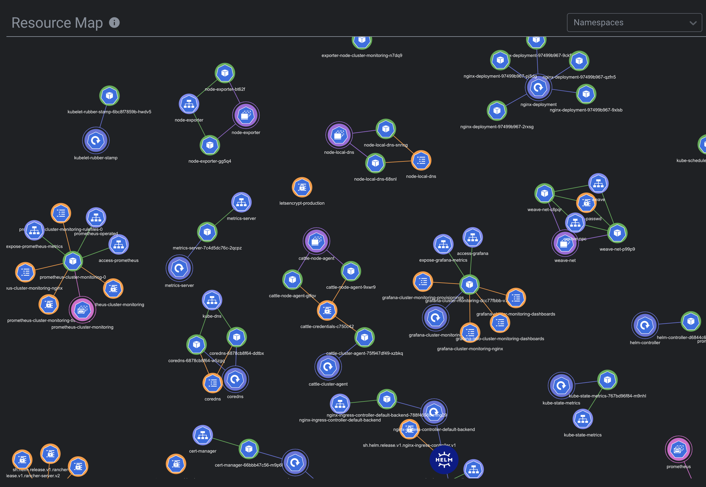

# FreeLens Resource Map

> [!NOTE]
> This is a fork of [kube-resource-map](https://github.com/nevalla/lens-resource-map-extension),  
originally created by **Lauri Nevala**. This version has been adapted and updated for FreeLens.

## Overview 
The following is a description from the original repo : 

"Lens Resource Map is an extension for [Lens - The Kubernetes IDE](https://k8slens.dev) that displays Kubernetes resources and their relations as a real-time force-directed graph."

## License
This project is licensed under the MIT License.  
Original work © Lauri Nevala. 
Modifications © 2025 Yasmine Gharbi