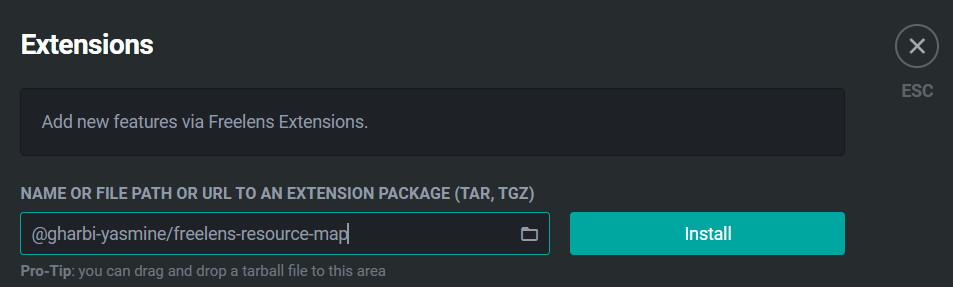

# FreeLens Resource Map

> [!NOTE]
> This is a fork of [kube-resource-map](https://github.com/nevalla/lens-resource-map-extension),  
originally created by **Lauri Nevala**. This version has been adapted and updated for FreeLens.

## Overview 
The following is a description from the original repo : 

"Lens Resource Map is an extension for [Lens - The Kubernetes IDE](https://k8slens.dev) that displays Kubernetes resources and their relations as a real-time force-directed graph."

## Installing

1. Go to the Extensions view (CMD+SHIFT+E on macOS and Windows).
2. Enter the name of this extension, @gharbi-yasmine/freelens-resource-map, into the Install Extension box.
3. Click on the Install button.

You can also download the .tgz file from the Release page of the github repo and import it into Freelens.

## License
This project is licensed under the MIT License.  
Original work © Lauri Nevala. 
Modifications © 2025 Yasmine Gharbi